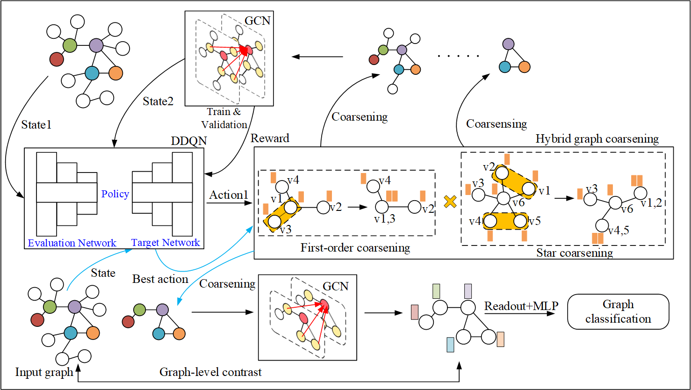

# AdaPool
Code for the KDD 2023 paper "AdaPool: Adaptive Graph Pooling via Reinforced Hybrid Graph
Coarsening Networks".


# Data preparation
The datasets used in this paper are from [TUDatasets](https://chrsmrrs.github.io/datasets/docs/datasets/), which can be accessed directly through pytorch geometric.
# Requirements
This code run with Python 3. 
- torch == 1.10.2+cu113
- torch-geometric == 2.0.3
- torch-cluster == 1.5.9
- torch-scatter == 2.0.9
- torch-sparse == 0.6.12
- magic-graph
```
git clone https://github.com/phanein/magic-graph.git
cd magic-graph
python setup.py install
```
# Train
```
git clone https://github.com/ot4f/Adapool.git
cd Adapool
mkdir data
python main.py --dataset PROTEINS
```